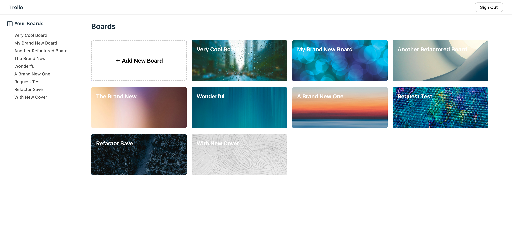
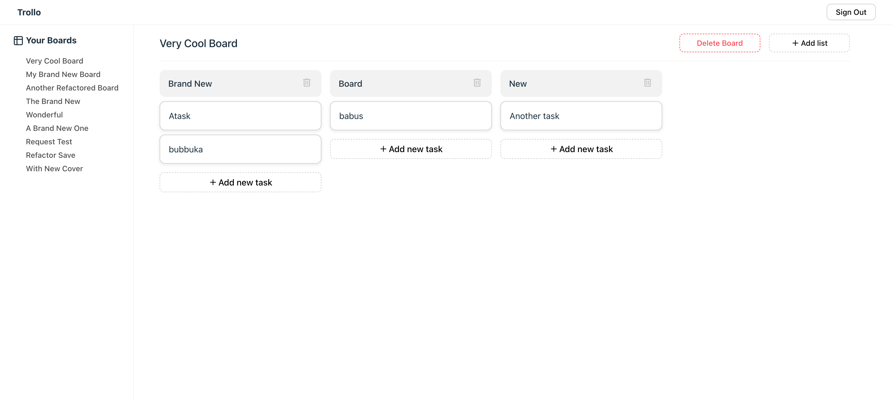

# Trollo

## Overview

Trollo is a simple and intuitive application designed to help users manage their projects through boards, container lists, and tasks. It includes user authentication, task organization, and a drag-and-drop interface for smooth task management. Below is a breakdown of the current features and upcoming improvements.

## Tech stack

- React
- TypeScript
- Supabase (backend and authentication)
- Jest/React testing library
- React Router
- React Query

## Features

1. User Authentication
   Users can register with an email and password to create their account.
   Users can log in to access their personalized task management workspace.
2. Boards
   Users can create boards to organize their tasks and projects.
   Each board can contain multiple container lists (to-do, in-progress, completed, etc.).
3. Container Lists
   Container lists allow users to categorize and group tasks within a board.
   Users can create, delete, and organize these lists as needed.
4. Tasks
   Users can create individual tasks within container lists.
   Tasks can be dragged and dropped between lists for easy task management.
5. Drag and Drop
   The app features a smooth drag-and-drop interface, allowing users to move tasks between lists and boards seamlessly.

## Todo (Upcoming Features)

- User Profile: Add user profile pages with customizable information.
- Task Description: Provide the ability to add detailed descriptions for each task.
- Tagging Tasks: Implement tagging for tasks to enhance organization and filtering.
- OAuth Integration: Implement social media OAuth (e.g., Google, GitHub) for faster and easier user registration and login.

## How to run locally

1. Clone the repository
2. Install dependencies with `npm install`
3. Go to Supabase and create an account. Set up a new project, and note your Supabase URL and API Key. In the root directory, create a .env file to store your Supabase credentials based on the .env.example file.
4. Run the development server `npm run dev`

